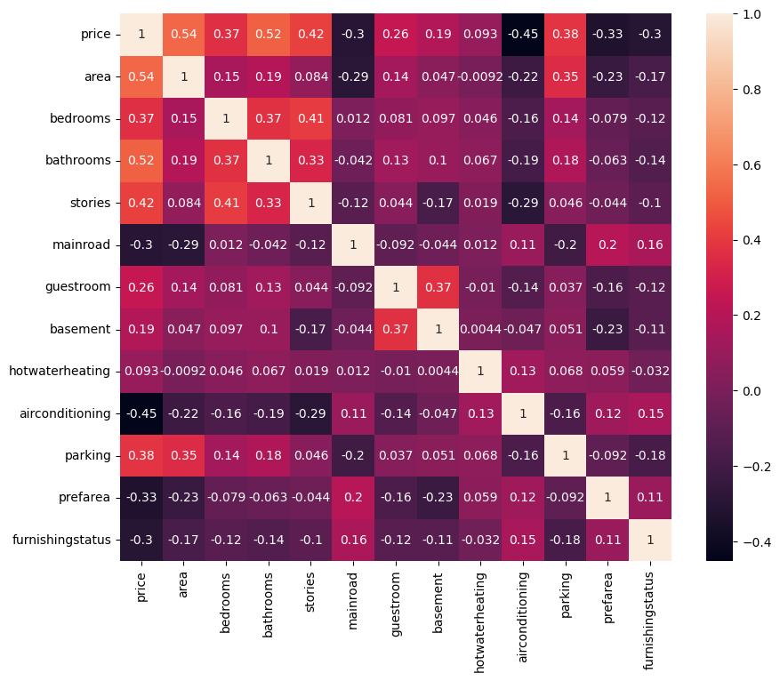
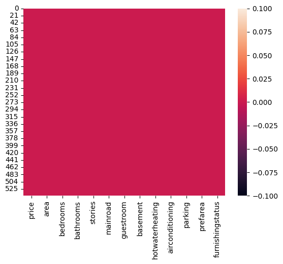
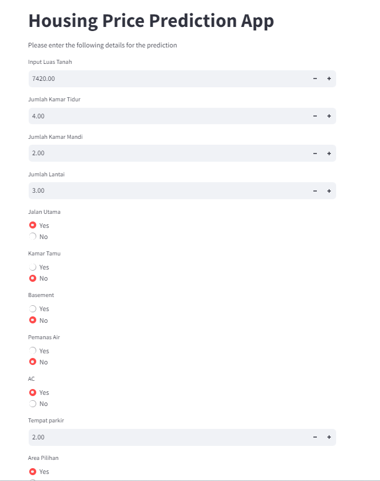

# Laporan Proyek Machine Learning
### Nama : Syams Muhammad Haryanto
### Nim : 211351144
### Kelas : Pagi B

## Domain Proyek

Rumah adalah kebutuhan primer bagi setiap manusia di muka bumi ini. Web App ini dapat memberikan layanan estimasi harga rumah. Sangat cocok bagi orang yang ingin melihat-lihat atau ingin membeli rumah.

## Business Understanding

Dengan memasukkan beberapa komponen yang anda inginkan sebagai spesifikasi, Web App ini dapat memberikan estimasi harga rumahnya. Anda cukup menggunakan Web App ini, mendapatkan estimasi harganya, lalu cari harga rumah yang sesuai dengan yang ada inginkan.

## Business Understanding

Banyak dari beberapa orang yang sulit mengetahui harga rumah serta detail spesifikasi keseluruhan dari rumah yang akan dibeli.

### Goals

Dengan adanya Web App ini diharapkan dapat membantu menemukan harga rumah serta memberikan informasi terkait detail spesifikasi keseluruhannya.

## Data Understanding

Datasets yang saya gunakan adalah Housing Price Prediction yang saya dapatkan dari website [Kaggle](https://www.kaggle.com/) . Datasets ini memiliki 13 kolom data, berikut adalah link menuju ke datasets terkait.<br>

[Housing Price Prediction](https://www.kaggle.com/datasets/harishkumardatalab/housing-price-prediction).

### Variabel-variabel pada Housing Price Prediction Dataset adalah sebagai berikut:

1. price                : merupakan harga rumah.
2. area                 : merupakan total luas rumah dalam meter persegi.
3. bedrooms             : merupakan jumlah kamar tidur.
4. bathrooms            : merupakan jumlah kamar mandi.
5. stories              : merupakan jumlah lantai
6. mainroad             : merupakan apakah rumah terhubung ke jalan utama(Yes/No).
7. guestroom            : merupakan apakah rumah memiliki kamar tamu(Yes/No).
8. basement             : merupakan apakah rumah memiliki basement(Yes/No).
9. hotwaterheating      : merupakan apakah rumah memiliki sistem pemanas air panas(Yes/No).
10. airconditioning     : merupakan apakah rumah memiliki sistem pendingin udara(Yes/No).
11. parking             : merupakan jumlah tempat parkir yang tersedia di dalam rumah.
12. prefarea            : meurpakan apakah rumah terletak di area yang disukai(Yes/No).
13. furnishingstatus    : merupakan status furnitur rumah(Furnished, Semi-Furnished, Unfurnished).

## Data Preparation

Untuk data preparation ini saya melakukan EDA (Exploratory Data Analysis) lalu dikarenakan datasetsnya sudah cukup bersih maka saya hanya akan mengubah data object menjadi data numerik agar nantinya bisa diproses oleh Linear Regression.

Langkah pertama adalah memasukkan token kaggle,
``` bash
from google.colab import files
files.upload()
```

Lalu kita harus membuat folder untuk menampung file kaggle yang telah diupload,
``` bash
!mkdir -p ~/.kaggle
!cp kaggle.json ~/.kaggle/
!chmod 600 ~/.kaggle/kaggle.json
!ls ~/.kaggle
```

Lalu, download datasets menggunakan code dibawah ini, 
``` bash
!kaggle datasets download -d harishkumardatalab/housing-price-prediction
```

Setelah download telah selesai, langkah selanjutnya adalah mengektrak file zipnya kedalam sebuah folder,
``` bash
!mkdir housing-price-prediction
!unzip housing-price-prediction.zip -d housing-price-prediction
!ls housing-price-prediction
```
Datasets telah diekstrak, seharusnya sekarang ada folder yang bernama Housing dan di dalamnya terdapat file dengan ektensi .csv.

Selanjutnya mengimpor semua library yang akan digunakan bagi proses data preparation ini,
``` bash
import pandas as pd
import numpy as np
import matplotlib.pyplot as plt
import seaborn as sns
```

Selanjutnya, mari baca file .csv yang tadi kita ekstrak,
``` bash
df = pd.read_csv('housing-price-prediction/Housing.csv')
```

Lalu melihat 5 data pertama yang ada pada datasets,
``` bash
df.head()
```

Lalu untuk melihat jumah data, mean data, data terkecil dan data terbesar bisa dengan kode ini,
``` bash
df.describe()
```

Untuk melihat typedata yang digunakan oleh masing-masing kolom bisa menggunakan kode ini,
``` bash
df.info()
```

Selanjutnya memisahkan data-data unique menjadi integer, seperti berikut, <br>
Pertama harus mencari terlebih dahulu data unique yang bertype string(object),
``` bash
pd.unique(df.mainroad)
pd.unique(df.guestroom)
pd.unique(df.basement)
pd.unique(df.hotwaterheating)
pd.unique(df.airconditioning)
pd.unique(df.prefarea)
pd.unique(df.furnishingstatus)
```

Selanjutnya membuat fungsi untuk menjadikan masing-masing string menjadi sebuah integer,
``` bash
def change_string_to_int(column):
    variables=pd.unique(df[column])
    for item in range(variables.size):
        df[column]=[item if each==variables[item] else each for each in df[column]]
    return df[column]
```

Lalu mengimplementasikan fungsi yang tadi sudah dibuat dan memasukkan hasilnya pada kolom yang sesuai, 
``` bash
df["mainroad"]=change_string_to_int("mainroad")
df["guestroom"]=change_string_to_int("guestroom")
df["basement"]=change_string_to_int("basement")
df["hotwaterheating"]=change_string_to_int("hotwaterheating")
df["airconditioning"]=change_string_to_int("airconditioning")
df["prefarea"]=change_string_to_int("prefarea")
df["furnishingstatus"]=change_string_to_int("furnishingstatus")
```

Lalu melihat 5 data pertama yang ada pada datasets, apakah variabel string sudah menjadi integer,
``` bash
df.head()
```

Selanjutnya kita akan melihat korelasi antar kolomnya,
``` bash
plt.figure(figsize=(10,8))
sns.heatmap(df.corr(),annot=True)
```
<br>
Bisa terlihat disini bahwa korelasi antar kolom cukup tinggi.

Selanjutnya melihat apakah di dalam datasetsnya terdapat nilai null,
``` bash
sns.heatmap(df.isnull())
```
<br>
Semuanya merah yang menandakan bahwa datasetsnya tidak memiliki data null di dalamnya,<br>
Selanjutnya kita akan membuat modelnya.

## Modeling
Untuk modeling ini saya menggunakan Linear Regression sebagai algorithm trainnya.

Langkah pertama yang harus dilakukan adalah mengimpor semua library yang akan digunakan nanti,
``` bash
from sklearn.linear_model import LinearRegression
from sklearn.model_selection import train_test_split
```

Selanjutnya kita lakukan seleksi fitur dengan memisahkan mana saja atribut yang akan dijadikan sebagai fitur dan atribut mana yang dijadikan label,
``` bash
features = ['area','bedrooms','bathrooms','stories','mainroad','guestroom','basement','hotwaterheating','airconditioning','parking','prefarea','furnishingstatus']
x = df[features]
y = df['price']
x.shape, y.shape
```

Lalu memisahkan data training dan data testing,
``` bash
x_train, X_test, y_train, y_test = train_test_split(x,y,random_state=10)
y_test.shape
```

Selanjutnya membuat model Linear Regression dan memasukkan hasil train yang tadi dibuat,
``` bash
lr = LinearRegression()
lr.fit(x_train,y_train)
pred = lr.predict(X_test)
```

Pembuatan model sudah selesai, mari lihat score yang didapatkan,
``` bash
score = lr.score(X_test, y_test)
print('akurasi model regresi linear = ', score)
```
Model dengan score 72.39% cukup bagus.

Lalu kita akan uji dengan data inputan kita sendiri,
``` bash
input_data = np.array([[7420,4,2,3,0,0,0,0,0,2,0,0]])

prediction = lr.predict(input_data)
print('Estimasi harga rumah :', prediction)
```
Hasilnya adalah 8322 USD.

Sebelum mengakhiri ini, kita harus ekspor modelnya menggunakan pickle agar nanti bisa digunakan pada media lain.
``` bash
import pickle

filename = 'prediksi_rumah.sav'
pickle.dump(lr,open(filename,'wb'))
```

## Evaluation

Disini saya menggunakan F1 score sebagai metrik evaluasi.

F1 Score: F1 score adalah rata-rata harmonis antara presisi dan recall. F1 score memberikan keseimbangan antara presisi dan recall. F1 score dihitung dengan menggunakan rumus: 2*(P*R/P+R)
```bash
from sklearn.metrics import precision_recall_curve, f1_score

threshold = 0.5

y_pred_binary = (pred > threshold).astype(int)
y_test_binary = (y_test > threshold).astype(int)

f1 = f1_score(y_test_binary, y_pred_binary)

print('f1 Score :', f1)
```
Hasil yang didapat adalah 1.0 atau 100%. Jadi, model ini memiliki keseimbangan yang sangat baik antara presisi dan recall.

## Deployment
[Housing Price Prediction](https://prediksi-rumah.streamlit.app/)
